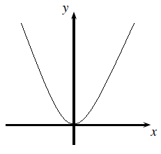
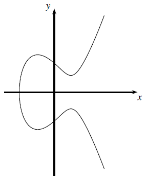
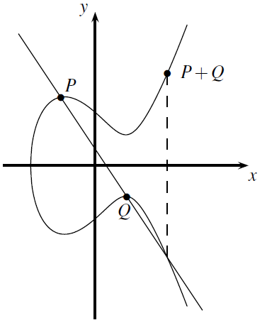
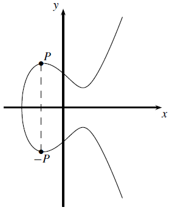
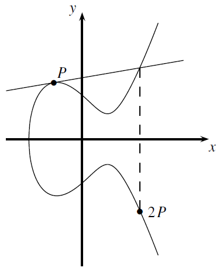
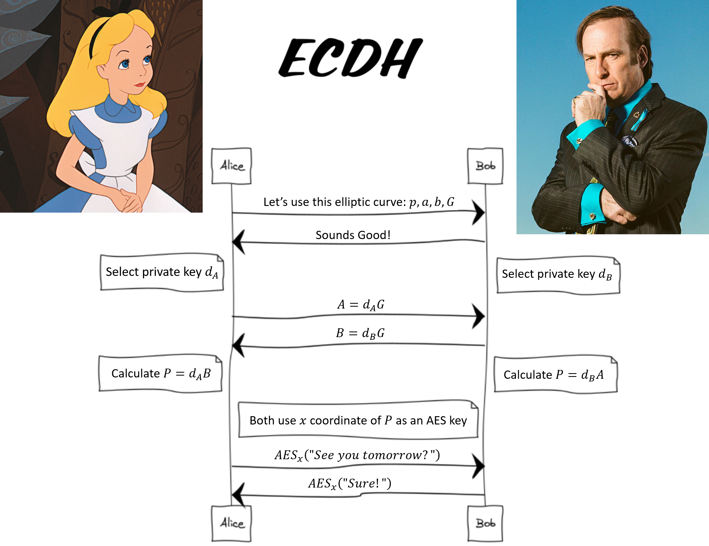
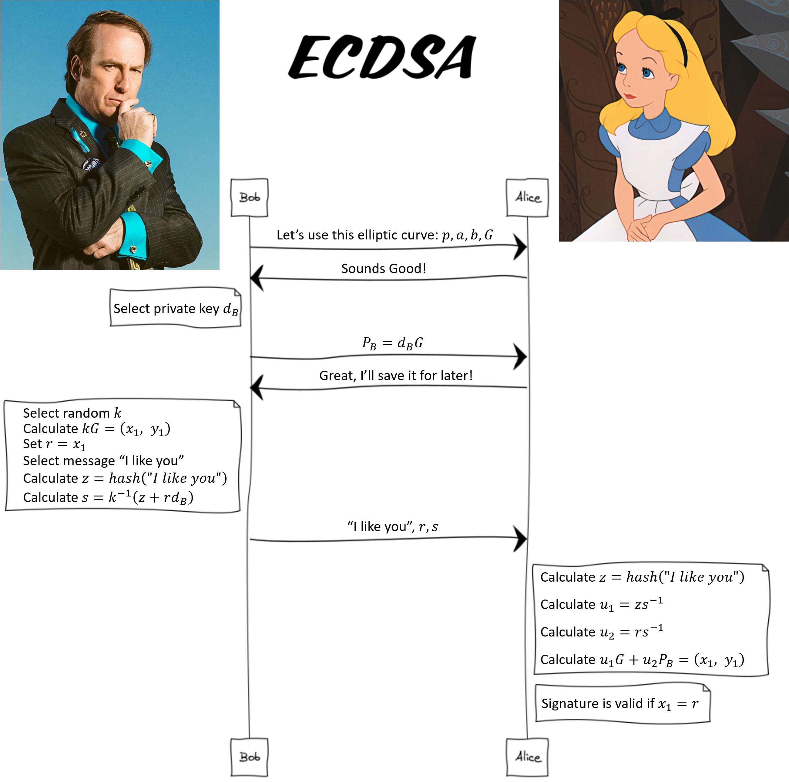
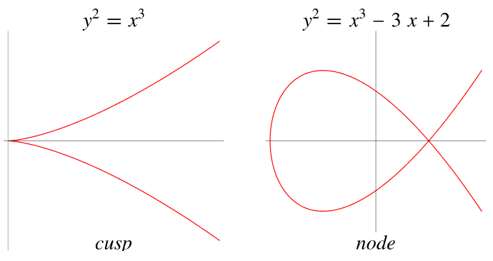

# Known Attacks On Elliptic Curve Cryptography
- [Introduction](#Introduction)
- [Introduction To Elliptic Curves](#Introduction-To-Elliptic-Curves)
- [Elliptic Curves In The Context Of Cryptography](#Elliptic-curves-in-the-context-of-cryptography)
- [ECC Attacks](#ECC-Attacks)

### ECDH Attacks
- [The Order Of The Generator Is Too Small](#The-order-of-the-generator-is-too-small)
- [The Order Of The Generator Is A Smooth Number](#The-order-of-the-generator-is-a-smooth-number)
- [The Order Of The Generator Is Almost A Smooth Number, And The Private Key Is Small](#The-order-of-the-generator-is-almost-a-smooth-number-and-the-private-key-is-small)
- [Not Verifying That A Point Is On The Curve](#Not-verifying-that-a-point-is-on-the-curve)
- [The Curve Is Singular](#The-curve-is-singular)
- [The Curve Is Supersingular](#The-curve-is-supersingular)
- [The Curve Is Anomalous](#The-curve-is-anomalous)

### ECDSA Attacks
- [Not Hashing The Message Before Signing It](#Not-hashing-the-message-before-signing-it)
- [Reusing The Same Value Of k In Different Signatures](#Reusing-the-same-value-of-k-in-different-signatures)
- [Generating k Values Insecurely](#Generating-k-values-insecurely)
- [Not Verifying The Generator Is Valid](#Not-verifying-the-generator-is-valid)

### Conclusion
- [ECDH Attacks Overview](#ECDH-attacks-overview)
- [ECDSA Attacks Overview](#ECDSA-attacks-overview)
- [Protection Against These Attacks](#Protection-against-these-attacks)
- [References](#References)

# Introduction
In recent years the Elliptic Curve Cryptography approach has become popular due to its high efficiency and strong security. The purpose of this article is to present this topic in a relatively clearer way than it exists today on the internet.

In this article I will present what elliptic curves are, the basic operations that can be performed on them, and how they can be used in cryptographic context. The majority of this article consists of examples of known attacks on incorrect implementations or wrong uses of them. Throughout the article I try to separate the explanation into an intuitive and high level part, and a mathematical part that goes into more details. The reader is invited to focus on which of the parts that interests them in that place, and skip the parts that are less.

Happy reading!

# Introduction To Elliptic Curves
### An Elliptic Curve
In general, an elliptic curve is some kind of curved line. An example of this is the parabola, whose equation is of the form $𝑦 = 𝑎𝑥^2 + 𝑏𝑥 + 𝑐$ and it looks like this:



In the context of cryptography, it is customary to use elliptic curves whose equation is of the form

$𝑦^2 = 𝑥^3 + 𝑎𝑥 + 𝑏$

For example, an elliptic curve corresponding to the equation $𝑦^2 = 𝑥^3 − 3𝑥 + 3$ looks like this:



The equation of the curve defines the relation between the `𝑥` coordinate of a point on the curve and its `𝑦` coordinate. In a cryptographic context, we restrict `𝑥`, `𝑦`, `𝑎`, `𝑏` to be integers, and restrict the calculations be modulo some large prime number. So the equation of the elliptic curve is:

$𝑦^2 = 𝑥^3 + 𝑎𝑥 + 𝑏\ \ \ \ (mod\ 𝑝)$.

This means that we have a finite number of points on the curve. In mathematical language, the curve is defined to be over a finite field of order `𝑝`. As a result now not necessarily every `𝑥` coordinate will have a corresponding point on the curve, because it may be that the `𝑦` coordinate corresponding to it is not an integer.


### Points On The Curve
The set of points on the curve consists of pairs of integers `(𝑥, 𝑦)` that satisfy the equation of the curve. In addition to these points, another special point called "Infinity" is defined, and it is denoted by `𝒪`. In mathematical language, this point is the neutral element of the set of points on the curve with respect to the addition operation, which we will define in the next section. The number of points on the curve (including the point `𝒪`) is called the "order of the curve".

Another observation is that elliptic curves are symmetric to the `X` axis. Which means that if the point `𝑃 = (𝑥, 𝑦)` is on the curve, then the point `−𝑃 = (𝑥, −𝑦)` is also on the curve. In fact, these points are considered "inverses" of each other (hence the marking `−𝑃` for the second point), and the result of the addition operation between them is defined to be the neutral element `𝒪`.

A theorem called Hasse's Theorem provides an estimation of `#𝐸`, the order of the curve, and is the order of magnitude of `Θ(𝑝)`. More accurately:

$𝑝 + 1 − 2\sqrt𝑝 ≤ 𝐸 ≤ 𝑝 + 1 + 2\sqrt𝑝$

### Points Addition
Given two points on the curve, it is possible to define an addition operation between them, resulting in a third point that is also on the curve. To find this point geometrically, we draw a line between the two given points, and continue it until it intersects the curve at a third point. This point is reflected in relation to the `𝑋` axis, and the resulting point is defined as the result of the addition.

Here is a diagram that shows how, given the points `𝑃` and `𝑄`, the point `𝑃 ​​+ 𝑄` can be found:



A question that may arise from this description is what happens if the line that is drawn between the two points does not intersect the curve again? In this case the line is said to intersect the curve at "infinity", and the result of the addition is the point `𝒪`. Notice that this case happens if the drawn line is vertical, that is, we are trying to add a point `𝑃` ​​with its inverse point, `−𝑃`:



Two basic identities are derived from this. For every point `𝑃` it ​​holds that:

`𝑃 + 𝒪 = 𝑃`\
`𝑃 + (−𝑃) = 𝒪`

Another question that arises from the geometric description is how do we add a point to itself? We saw that in order to add two different points `𝑃` and `𝑄`, we draw a line between them and look at the intersection point of its continuation with the curve. Intuitively, we will leave `𝑃` constant, and look at the line that is created as we move `𝑄` "closer and closer" to `𝑃`, until `𝑄` will merge with `𝑃`. What we will get is a line that is more and more "tangent" to the curve at the point `𝑃`, and this is exactly the line we will look at when we want to add `𝑃` to itself:



To add a point `𝑃` to itself, we draw a tangent to the curve at the point `𝑃`, and continue it until it intersects the curve at a second point. This point is reflected in relation to the `𝑋` axis, and the resulting point is defined as the result of the addition. It is customary to mark the result of the addition as `𝑃 + 𝑃 = 2𝑃`. Again if the tangent does not intersect with the curve at a second point then it is said to intersect the curve at "infinity", and the result of the addition in this case is the point `𝒪`.

These visual geometric descriptions illustrate nicely and help us understand how point addition works. But how do we actually calculate it? Mathematical equations, of course!

Given the points $𝑃 = (𝑥_𝑃, 𝑦_𝑃)$ and $𝑄 = (𝑥_𝑄, 𝑦_𝑄)$, the result of their addition is the point $𝑅 = (𝑥_𝑅, 𝑦_𝑅)$ such that:


$𝑥_𝑅 = 𝜆^2 − 𝑥_𝑃 − 𝑥_𝑄\ \ \ \ \ \ \ \ \ (mod\ 𝑝)$ \
$𝑦_𝑅 = 𝜆(𝑥_𝑃 − 𝑥_𝑅) − 𝑦_𝑃\ \ \ \ (mod\ 𝑝)$

Where `𝜆` is defined to be the slope of the line connecting the points, if they are different, and the slope of the tangent to the curve at the point, if the point is added to itself. Formally:

$\displaystyle𝜆 = \frac{𝑦_𝑃 − 𝑦_𝑄}{𝑥_𝑃 − 𝑥_𝑄}\ \ \ \ \ (mod\ 𝑝)\ \ \ ;\ \ \   𝑖𝑓 𝑃 ≠ 𝑄$\
$\displaystyle𝜆 = \frac{3{𝑥_𝑃}^2 + 𝑎}{2𝑦_𝑃}\ \ \ \ (mod\ 𝑝)\ \ \ ;\ \ \   𝑖𝑓 𝑃 = 𝑄$

The mathematical calculations behind points addition are not critical for the rest of the article. For that matter, we can look at point addition as a black box that receives two points on the curve and returns a third point that is also on the curve.

### Multiplying A Point On The Curve By A Constant
We saw that it is possible to add a point `𝑃` ​​to itself, and we denoted the resulting point by `2𝑃`. If we add the point `𝑃` ​​to this result again, we will reach a point denoted by `3𝑃`, and so on. In this way it is possible to define "multiplication" of a point by a constant, by repeatedly adding the point to itself (similarly to the multiplication between numbers):

$𝑛𝑃 = 𝑃 + 𝑃 + ⋯ + 𝑃\ \ \ \ \ (n\ times)$

Seemingly, to multiply a point by a number `𝑛` we need to perform `𝑛` add operations between points. This is because given a starting point, it is difficult to know in advance where the "last" point will fall, without reaching it "step by step". Such a calculation would be very inefficient, because `𝑛` could be very large.

For this purpose, the `Double And Add` algorithm exists, in which we start from the point `𝑃`, then for each bit in the binary representation of `𝑛`, the current point is multiplied by `2` (that is, it is added to itself), and is added to the result if the bit value is `1`. The runtime complexity of this algorithm is `𝑂(log 𝑛)`, and it allows to efficiently multiply points by very large numbers.

An important property of point multiplication that we will use later is that for every point `𝑃` and pair of numbers `𝑎`, `𝑏` it holds:

$𝑏(𝑎𝑃) = (𝑏𝑎)𝑃 = (𝑎𝑏)𝑃 = 𝑎(𝑏𝑃)$

Intuitively, suppose we start from point `𝑃`, take `𝑎` steps from it, and reach the point `𝑎𝑃`. From this point, we take `𝑏` steps of "size" `𝑎` and reach the point `𝑏(𝑎𝑃)`. Alternatively, in another scenario, we could start from point `𝑃`, take `𝑏` steps with it and reach point `𝑏𝑃`. From this point take `𝑎` steps of "size" `𝑏` and reach the point `𝑎(𝑏𝑃)`.

In both scenarios we took the same amount of `𝑎𝑏` steps from the point `𝑃` in total, so in both scenarios we reached the same final point. Mathematically, multiplying a point by a constant is associative.


### Generator Point
If we start from a point `𝑃` ​​and add it to itself again and again and again, at each such step we will reach some new point on the curve. Because there is a finite number of points on the curve, at some stage we will reach again to points we have reached before, and we will be in some kind of loop, or a "circle". More precisely, at some stage we will reach the point `-𝑃`, in the next step we will reach the point `𝒪`, and in the step after that we will again reach the point `𝑃`, from which we started.

The point that creates such a "circle" is called a Generator, because the entire "circle" can be generated from it, and it is customary to mark it with the letter `𝐺`. The number of points in the "circle" (including the point `𝒪`) is called the "order of the generator `𝐺`", and is usually denoted by `𝑛`. Each point on the curve forms a "circle" of some sort. Mathematically, the set of points on this "circle" is a cyclic group.

An interesting property that results from this is that multiplying a point `𝐺` by its order `𝑛` gives us the point of infinity:\
`𝑛𝐺 = 𝒪`

### The Hard Problem
“Given points `𝑃` and `𝑄` such that `𝑄 = 𝑥𝑃` for some `𝑥`, it is hard to find `𝑥`.”


And in words, suppose someone started from some starting point, took a certain number of steps from it, and reached a final point. Given the starting point and the final point, how do we know how many steps they took?

The answer to this question is not so intuitive, because it is difficult to predict in advance from a starting point which points will be reached by taking steps from it. A naive solution could be to start from `𝑃` ourselves, advance forward from it one step at a time and count the steps we take, until we reach `𝑄`. The complexity of this solution is `𝑂(𝑥)`, and it is unfeasible if it is known that `𝑥` is a large number, for example if `𝑥` is `256 bit`.


This problem is called the Elliptic Curve Discrete Logarithm Problem (ECDLP), and it is a hard problem. But how hard is it?

In a cryptographic context, it is customary to measure "difficulty of problems", or "strength of a cryptographic system", with a metric called `Security Level`. In this metric, a problem is said to have "`𝑛` bits security" if the best known attack solves the problem in $𝑂(2^𝑛)$ steps.

Currently, the best algorithm that solves the ECDLP problem does it with a complexity of $𝑂(\sqrt n)$, where `𝑛` is the order of the point `𝑃`, and it does it using a Meet In The Middle attack. When a point with a big enough order is selected, solving it is unfeasible, hence the strength of the problem.

For example, if we choose `𝑛` of size `256 bit`, we get that the ECDLP problem has a security level of `128 bit` security. For comparison, to achieve the same security level of `128 bit` security in RSA encryption, which is based on the problem of integer factorization, a public key with a size of `3072 bit` is required. This makes the use of elliptic curves relatively more computationally efficient.


# Elliptic Curves In The Context Of Cryptography
After all this introduction to the world of elliptic curves, we will move on to see what can be done with them in a cryptographic context. As we know, cryptographic systems are usually based on a "hard problem" that is difficult to solve. For example RSA with the problem of factoring a number that we mentioned, or the Diffie-Hellman protocol with the discrete logarithm problem. A cryptographic system that is based on the ECDLP problem in an elliptic curve belongs to the Elliptic Curve Cryptography family, or for short ECC.


### First Use Of Elliptic Curves - Agreement On A Shared Secret
Let's start with a story. Imagine you are at a party - a room full of people, where everyone can talk to everyone and everyone hears everyone. In this room there are also Alice and Bob, who have never met before. Alice likes Bob, and she wants to ask him out. Alice is a little shy, so she wants to tell Bob this secret message without all the other party guests hearing her. Alice and Bob have not coordinated anything in advance, and everything Alice says to Bob will be heard by all the other guests at the party. How can Alice tell the message to Bob without anyone else hearing it?

If you answered "elliptic curves", then you are right!

Alice will select some elliptic curve and a generator in it, and tell them to Bob. Specifically, Alice will pass to Bob (and everyone else in the room) the two curve parameters `𝑎`, `𝑏`, the modulus `𝑝`, and the generator `𝐺`. In addition, Alice will select some value $𝑑_𝐴$ in the range $1 ≤ 𝑑_𝐴 ≤ 𝑛 − 1$ where `𝑛` is the order of `𝐺`. The value $𝑑_𝐴$ is called Alice's private key. Alice will calculate the point $𝐴 = 𝑑_𝐴𝐺$, which is called Alice's public key, and tell it to Bob. Similarly, Bob will select a private key $𝑑_𝐵$, calculate the point $𝐵 = 𝑑_𝐵𝐺$, which is called Bob's public key, and tell it to Alice.

Alice will take Bob's public key, multiply that point by her private key, and reach a third point $𝑃_𝐴 = 𝑑_𝐴𝐵$. Similarly, Bob will take Alice's public key, multiply it by his private key, and reach a third point of his own $𝑃_𝐵 = 𝑑_𝐵𝐴$. If we examine the points that Alice and Bob reached separately, we find that they reached the same point! This fact comes from the associativity property of multiplying a point by a constant we saw before:

$𝑃_𝐴 = 𝑑_𝐴𝐵 = 𝑑_𝐴(𝑑_𝐵𝐺) = 𝑑_𝐵(𝑑_𝐴𝐺) = 𝑑_𝐵𝐴 = 𝑃_𝐵$

At the end of the whole process, Alice and Bob managed to reach an agreement on some point on the curve, and at no stage did either of them pass that point to the other person. The information everyone has heard is: `𝑎`, `𝑏`, `𝑝`, `𝐺`, `𝐴`, `𝐵`. A person who is in the room listening to this information cannot find the point that Alice and Bob agreed on with it.


This is because if another person in the room wanted to find that point, they would need to know either Alice's private key or Bob's private key in order to multiply `𝐵` or `𝐴` by them. To find Alice's private key for example, they will look at $𝐴 = 𝑑_𝐴𝐺$, because this is the only information that was sent and "contains" Alice's private key. Given `𝐺` and $𝑑_𝐴𝐺$, to find $𝑑_𝐴$ is equivalent to solving the discrete logarithm problem in elliptic curves, which is, as mentioned, a hard problem.

This beautiful protocol is called: Elliptic Curve Diffie-Hellman (ECDH).

### Using The Shared Secret For Further Communication
We haven't finished our story. Although Alice and Bob agreed on a shared secret point, Alice still did not ask Bob on the date she so badly wanted.

After the parties have agreed on a shared secret point, they can use it as the encryption key of any encryption method, for example AES, and from that point communicate securely through encryption.

It is common to take one of the `𝑥` or `𝑦` coordinates ​​of the point, and use it. To maintain safety, it is recommended to hash the selected value and use only the hash result as an encryption key. In practice, sometimes the value is too big to be used an an encryption key. For example, if the hash function used is SHA-1, its output length is `160 bit`, while AES encryption requires only `128 bit`. In such a case, it is customary to use only `128 bits` out of the `160`, and discard the rest.

Anyway, at this point Alice and Bob agree on an encryption key, and they are the only ones who know it. From this point on they communicate through encryption, and anyone listening in the room cannot understand what they are saying.

Here is a diagram of the protocol:


Using the agreed upon key, Alice encrypts the message "Hey Bob, would you like to go out for coffee tomorrow evening?", and passes the encrypted message to Bob. Bob decrypts the message with the key he also knows. Alice hopes that Bob will say yes, but that is not a part of the protocol.

### The Similarities Between Elliptic Curve Diffie-Hellman And Diffie-Hellman
In the known Diffie-Hellman (DH) protocol, the parties openly transmit a prime number `𝑝` and a generator `𝑔` that is in the group corresponding to the value `𝑝`. Alice randomly generates a private key `𝑎` and openly broadcasts her public key $𝐴 = 𝑔^𝑎\ \ \ \ (mod\ 𝑝)$. Similarly Bob randomly generates a private key `𝑏` and openly broadcasts his public key $𝐵 = 𝑔^𝑏\ \ \ \ (mod\ 𝑝)$. Alice then takes Bob's public key and raises it to the power of her private key, thus calculates the value $𝐾 = 𝐵^𝑎 = (𝑔^𝑏)^𝑎 =𝑔^{𝑎𝑏}\ \ \ \ (mod\ 𝑝)$. In the same way Bob calculates the value $𝐾 = 𝐴^𝑏 = (𝑔^𝑎)^𝑏 =𝑔^{𝑎𝑏}\ \ \ \ (mod\ 𝑝)$. At the end of the process, Alice and Bob were able to agree on a common `𝐾` value, without transmitting it between them.

An attacker listening to them cannot find `𝐾` given the broadcasted values `𝑝`, `𝑔`, `𝐴`, `𝐵`. In order to do this, they will have to find either Alice's or Bob's private keys. To calculate Alice's private key for example, they would have to find `𝑎` given `𝑔` and $𝑔^𝑎\ \ \ \ (mod\ 𝑝)$, which is a hard problem. This problem is called the Discrete Logarithm Problem (DLP).

There is a very clear similarity between DH, which is based on DLP, and ECDH, which is based on ECDLP (they are basically the same, only with an EC prefix). In both protocols, two parties talking to each other can agree on some shared secret value , without them coordinating anything in advance. Anyone who listens to the messages between the parties will be exposed to the public information they pass between them, but will not be able to reach the secret value shared between them.


### Second Use Of Elliptic Curves - Signing A Message
Continuing our story, let's say that Alice and Bob went on their date and spent a nice evening together. The next day Alice receives a message saying "Hi Alice, this is Bob, I had a great time with you yesterday and I would love to meet you again this weekend". Alice suspects that it is not Bob who sent the message, because she knows that Bob had so much fun with her yesterday, that he will not wait until the weekend to meet her, but will want to meet her tomorrow! How can Alice verify that it is Bob who wrote the message?

If you answered "elliptic curves", then you are right again!

The difficulty of the ECDLP problem can also be used to sign messages. During their date, Alice and Bob agreed on some elliptic curve and a generator `𝐺` in it. Bob generated some value $𝑑_𝐵$, called Bob's private key, and calculated the point $𝑃_𝐵 = 𝑑_𝐵𝐺$, called Bob's public key. Bob gave Alice his public key so that she could use it to later verify if a message she receives was indeed signed by him.

Let's say Bob wants to sign a certain message `𝑚`. He will calculate the value $z = hash(m)$ using some secure hash function, and keep an amount of bits from the result equal to the bit length of `n`, the order of the generator `𝐺`. Bob will generate some random value `𝑘` in the range $1 ≤ 𝑘 ≤ 𝑛 − 1$. Bob will then calculate the point $𝑘𝐺 = (𝑥_1, 𝑦_1)$, take its `𝑥`-coordinate, and calculate $𝑟 = 𝑥1\ \ \ \ (mod\ n)$. Finally, Bob will calculate the value $𝑠 = 𝑘^{−1}(𝑧 + 𝑟𝑑_𝐵)$.

The signature of the message `𝑚` is defined to be the pair of calculated values ​​`𝑟` and `𝑠`.

Suppose that Alice received a certain message `𝑚`, and its signature consists of a pair of values `​𝑟` and `𝑠`. Alice wants to make sure that it is indeed Bob who signed the message. Alice will calculate the value $z = hash(m)$ in the same way as Bob. Alice will then calculate the values $𝑢_1 = 𝑧𝑠^{−1}$ and $𝑢_2 = 𝑟𝑠^{−1}$. Finally Alice will use Bob's public key $𝑃_𝐵$, and calculate the point $𝑢_1𝐺 + 𝑢_2𝑃_𝐵 = (𝑥_1, 𝑦_1)$. The signature will be considered valid if it holds that $𝑟 ≡ 𝑥_1\ \ \ \ (mod\ n)$. The reason this is correct is that it holds:

$𝑢_1𝐺 + 𝑢_2𝑃_𝐵 = 𝑧𝑠^{−1}𝐺 + 𝑟𝑠^{−1}𝑃_𝐵 = 𝑠^{−1}(𝑧𝐺 + 𝑟𝑃_𝐵) = 𝑠^{−1}(𝑧𝐺 + 𝑟𝑑_𝐵𝐺) = 𝑠^{−1}(𝑧 + 𝑟𝑑_𝐵)𝐺 = 𝑘(𝑧 + 𝑟𝑑_𝐵)^{−1}(𝑧 + 𝑟𝑑_𝐵)𝐺 = 𝑘𝐺$

If the signature is valid, the `𝑥` coordinate of this point should indeed be `𝑟` as it is defined in the message signature. It should be noted that the order of the generator `𝐺`, which is denoted by the letter `𝑛`, should be a prime number, and this is so that it will indeed be possible to calculate the inverse numbers in the signature and verification algorithms.

It can be seen that only the person who holds the private key $𝑑_𝐵$ can create a valid signature for the public key $𝑃_𝐵$. An attacker who does not have the value $𝑑_𝐵$, cannot calculate the value `𝑠` corresponding to $𝑃_𝐵$ in the signature. If the attacker wants to create a signature that matches a certain message, they will have to solve the ECDLP problem, that is, find the private key $𝑑_𝐵$ given $𝐺$ and $𝑃_𝐵 = 𝑑_𝐵𝐺$, which is a hard problem.

This signature protocol is called Elliptic Curve Digital Signature Algorithm, or ECDSA for short. The protocol ensures that the signed messages have not been altered or forged, and in addition ensures that the person who signed the message cannot deny that they created it.

Unlike the ECDH protocol, where the parties did not have to coordinate anything in advance, in the ECDSA protocol the parties must agree in advance on a public key. Only after each party knows for sure that the public key they hold indeed belongs to the person they want to communicate with, the protocol can be used. Otherwise, there is no meaning in verifying the signature with the public key that each party possesses.

Back to our story. Alice knows for sure that the public key $𝑃_𝐵$ in her possession does belong to Bob, because Bob explicitly gave it to her on their date. Alice tries to verify the message with it and discovers that there is no match. of course! Someone else created the message and signed it, just as Alice suspected.

Here is a diagram of the protocol:



### The Similarities Between ECDSA And ElGamal
In the ElGamal protocol for signing messages, the parties agree on a large prime number `𝑝` and a generator number `𝑔`. The signing party generates some value `𝑑` in range $1 ≤ 𝑑 < 𝑝 − 1$, called the private key, calculates the value $𝑦 = 𝑔^𝑑\ \ \ \ (mod\ p)$, called the public key, and publishes it.

In order to sign a certain message, they calculate the value $z = hash(m)$ and generate a random value `𝑘` in the range $1 ≤ 𝑘 < 𝑝 − 1$ that is co-prime to $(p-1)$. They calculate $𝑟 = 𝑔^𝑘\ \ \ \ (mod\ p)$ and $𝑠 = 𝑘^{−1}(𝑧 − 𝑑𝑟)\ \ \ \ (mod\ (p-1))$. The signature of the message `m` is defined to be the pair of calculated values `​​𝑟` and `𝑠`.

The party that has received a certain message `𝑚`, and its signature consists of a pair of values ​​`𝑟` and `𝑠`, uses the public key `𝑦` to verify the signature by calculating the values $​𝑢_1 = 𝑟^𝑠𝑦^𝑟$ and $𝑢_2 = 𝑔^𝑧$. The signature will be considered valid if $𝑢_1 = 𝑢_2$. This is because according to the definition of `𝑠` it denotes:\
$𝑠 = 𝑘^{−1}(𝑧 − 𝑑𝑟)$, therefore $𝑘𝑠 = 𝑧 − 𝑑𝑟$, hence $𝑧 = 𝑘𝑠 + 𝑑𝑟$. Therefore:

$𝑢_2 = 𝑔^𝑧 = 𝑔^{𝑘𝑠+𝑑𝑟} = 𝑔^{𝑘𝑠}𝑔^{𝑑𝑟} = (𝑔^𝑘)^𝑠(𝑔^𝑑)^𝑟 = 𝑟^𝑠𝑦^𝑟 = 𝑢_1$

An attacker cannot create a valid signature for the public key `𝑦` without knowing the private key `𝑑`. To obtain the private key given the public key, the attacker would have to solve the DLP problem, which is a difficult problem.

Here too there is a clear similarity between ECDSA, which is based on ECDLP, and ElGamal, which is based on DLP. In both cases, the parties have to coordinate a public key in advance, and it is required to generate a random `𝑘` value every time we want to sign a new message. Also, in both cases an attacker listening to the messages between the parties cannot deduce useful information that would allow them to forge signatures.


# ECC Attacks
We saw how elliptic curves can be used in cryptographic systems for agreeing on a secret value and for signing messages. As with everything in life, when it comes to putting something into practice, things don't always work as planned. In the rest of the article I will present different ways to attack ECC-based cryptographic systems that have been misused by the user, or implemented in an unsafe manner.

Naturally, I split this part into attacks on ECDH and attacks on ECDSA. In both cases we will say that we "succeeded" in the attack if we find the private key of one of the parties, and we will stop there. In the case of ECDH, it is enough because from the private key it is possible to reach the shared secret value and all the information encrypted with it later. In the case of ECDSA, this is enough because the private key can be used to sign messages as we wish.

### SageMath
SageMath is a free and open-source mathematical software. It can be written in almost the same syntax as Python, and it can also be used as a Python library. This library implements useful functions that are relevant to elliptic curves and is therefore very useful for the calculations we need to do in the context of ECC. As part of this article I provide code snippets written in this library. I found it is easiest to install it on the Ubuntu operating system, specifically version 22.04. To install it, simply run the command: `sudo apt install sagemath`.
To run a file that contains code, save the file with the .sage extension and run the command: `sage file.sage`.

Additionally, an interpreter can be used, similarly to Python's interpreter, by running the command: `sage`. It is also possible to create .py files in which the library sage.all is imported, and run them with the command `python3 file.py`. Note that when running a file with the command `sage`, the notation `^` is interpreted as power, while when running with `python3`, this notation is interpreted as xor.

In this article I mainly use the following functions in SageMath:
- `E.gens()` - finding generators in curve `E`
- `G.order()` - calculating the order of the generator `G`
- `n*G` -multiplication of the generator `G` by the number `n`
- `n.factor()` - factorize the number `n` into its factors - the function returns a list of pairs `(𝑝, 𝑒)` such that `𝑝` is a prime factor, and `𝑒` is its exponent, i.e. the number of times that `𝑝` appears in the decomposition of `n`
- `crt` - solving an equation system of the Chinese remainder theorem


# ECDH Attacks
## The Order Of The Generator Is Too Small
Perhaps the wrong use for ECDH that is easiest to attack is choosing a generator with an order `n` that is too small.
As mentioned, it is possible solve the ECDLP problem with a complexity of $O(\sqrt{n})$. When `𝑛` is too small, for example 32 bit, then it becomes feasible to solve this problem. There are several algorithms that solve the problem, including Baby-Step Giant-Step, Pollard's Rho, and Pollard's Lambda. These algorithms can be run as a black box with the help of SageMath, by using the `discrete_log` function:
```python
import random
p = random_prime(2^32)
a = random.randrange(p)
b = random.randrange(p)
E = EllipticCurve(GF(p), [a,b])
G = E.gens()[0]
n = G.order()
private_key = random.randrange(n)
A = private_key * G
found_key = G.discrete_log(A)
assert found_key * G == A
assert private_key == found_key
print("success!")
```

In this code snippet we choose parameters for the curve randomly under the limitation that `𝑝` is 32 bits long. This limitation guarantees us that the number of points on the curve is $O(2^{32})$ and therefore the order of each point in it is at most $O(2^{32})$ as well. After that we create the curve, choose some generator in it, generate a random private key, and calculate the public key. Finally, from the generator and the public key, we calculate the the discrete logarithm to find the private key, and verify that the key found is indeed correct. This code takes just a few seconds at most to find the private key.


## The Order Of The Generator Is A Smooth Number
As mentioned, the order of a generator is defined as the number of points in the "circle" formed when we add the generator point to itself over and over again, and it is denoted by `𝑛`. If `𝑛` is a composite number that can be factored into smaller prime factors, then it is possible to solve ECDLP efficiently. Such a number is called a Smooth Number, and for the purpose of this article, it is a number which can be factored into enough prime factors, each of which is small enough for our attack to work. The formal definition of a Smooth Number is a little different and not relevant for us.

Intuitively, this is done by "attacking" each of the prime factors separately. Given a generator point `𝐺` which forms a very large "circle", and some point `𝑃` in the "circle" such that `𝑃 = 𝑘𝐺`. The large "circle" can be dismantled into several small "circles", each the size of one prime factor of `𝑛`. In each small "circle" we can map `G` and `P` to other corresponding points `G'` and `P'` that are located in the small "circle", and satisfy `𝑃′ = 𝑘′𝐺′`. Because the "circle" is small, it is relatively easy to solve the problem and find `𝑘′`. Finally, we can combine all the small `𝑘′`s we found into the desired `𝑘` in the original "circle".

The algorithm that performs what I described is called Pohlig-Hellman Algorithm. Its runtime complexity is $O(\sqrt{p_{max}})$ where $p_{max}$ is the largest prime factor in the decomposition of `𝑛`. It also makes sense, because the "heaviest" part in the algorithm is solving the ECDLP problem in the largest "circle" among the smaller "circles". For example, `n` might be a 128 bit number, and it decomposes into prime factors such that the largest of which is a 30 bit number. The algorithm reduces the complexity of solving the problem from $2^{64}$ to $2^{15}$, thus turning it form unfeasible to feasible.

Fortunately, SageMath's `discrete_log` function performs this algorithm in its implementation. To run the attack you can simply call the function:


```python
p = 183740305291166889900894879302858411333
a = 13
b = 37
E = EllipticCurve(GF(p), [a,b])
G = E(123764810000715262449972298016641419881,
144640915410606177233842123838934486566)
n = G.order()
print("number of bits in n:", n.nbits())
print("n's factors:", n.factor())
print("number of bits in n's greatest factor:", n.factor()[-1][0].nbits())
import random
private_key = random.randrange(n)
A = private_key * G
print("Calculating discrete_log...")
found_key = G.discrete_log(A)
assert found_key * G == A
assert private_key == found_key
print("success!")
```

In this code snippet we define an elliptic curve and a generator in it, and print the prime factors of its order. The output is:


```
number of bits in n: 128
n's factors: 2 * 3 * 13 * 101 * 211 * 21141581 * 38581057 * 60652309 *
2234328781
number of bits in n's greatest factor: 32
Calculating discrete_log...
success!
```

It can be seen that although the order of the generator is 128 bits long, it breaks down into prime factors such that the largest prime factor is 32 bit.

After that, just like in the previous attack - we choose a random private key, calculate a public key from it, and then given the generator and the public key, calculate the private key and verify that it is correct.


Although we are done, we haven't seen how the "small" circles are defined, how to map the points `𝐺` and `𝑃` to their corresponding points `𝐺′` and `𝑃′`, and how to combine all of the small solutions into a big solution. I will try to explain it intuitively here, because the next attack is based on this part as well.


Suppose we have a "circle" of order `3𝑥5𝑥7 = 105`, and its generator is `𝐺`. We'll define a point `𝐺′ = (5𝑥7)𝐺 = 35𝐺`, and look at the "circle" generated from it. If we proceed from `𝐺′` one "step", i.e. we will add `𝐺′` to itself it will be like advancing 35 steps from the point `35𝐺` in the original "circle", and we will reach point `2𝐺′ = 70𝐺`. If we advance one more "step", we will reach the point `3𝐺′ = 105𝐺 = 𝒪`, and if we advance from it another "step", we will reach the point `4𝐺′ = 35𝐺 = 𝐺′`, i.e. back to the starting point. The "circle" formed by `G′` is of order `3`, and it is no coincidence, because on a "circle" of order `105` it is possible to take exactly `3` "steps" of the size `35`. Similarly, we could create a "circle" of order `5` by defining the point `𝐺′ = (3𝑥7)𝐺 = 21𝐺`, and a circle of order `5` by defining `𝐺′ = (3𝑥5)𝐺 = 15𝐺`.

When we look at it the other way around it gets more interesting. Suppose that in the original "circle" we took `𝑛` steps from the point `G` and we reached the point `𝑛𝐺`. If also in the small "circle" we took `𝑛` steps from the point `𝐺′`, we would reach the point `𝑛′𝐺′` such that `𝑛 ≡ 𝑛′ (𝑚𝑜𝑑 3)`. And why is it interesting? Because the order of `𝐺′` is much smaller than the order of `𝐺` and therefore given `𝐺′` and `𝑛′𝐺′`, we can relatively easily find `𝑛′`. If we do it, and do it also for the two other prime factors of the order of the "circle", which are `5` and `7`, we would have the following values:

𝑛 ≡ $𝑛'_1$ (𝑚𝑜𝑑 3)\
𝑛 ≡ $𝑛'_2$ (𝑚𝑜𝑑 5)\
𝑛 ≡ $𝑛'_3$ (𝑚𝑜𝑑 7)

From these three values, `𝑛` can be easily found by using the Chinese Remainder Theorem, and thus solve the original problem.


## The Order Of The Generator Is Almost A Smooth Number, And The Private Key Is Small
Suppose that, similarly to the previous attack, we would get a curve in which the order of the generator decomposes into prime factors, but this time, the largest prime factor is too large for it to be practical to solve its ECDLP. For example, if the generator order is `256 bit`, but the largest prime factor is `128 bit`.
The Pohlig-Hellman Algorithm will require about $O(2^{64})$ operations in order to find the private key, which is unfeasible.


If we know that the private key used is relatively small, it can still be found efficiently.
Let's assume that the private key is `64 bit` (instead of `256 bit`). When the public key is created, the generator is multiplied by the private key and you get some point in the "circle" that the generator creates. Although the "circle" is the size of about $2^{256}$ points, this point will "fall" somewhere in the "first" $2^{64}$ points. There is no "interaction" between the private key and the points in the "circle" that correspond to larger values.


It is possible to run the Pohlig-Hellman algorithm, but "discard" the too large "circles", provided that the product of the orders of the remaining "circles" will be at least as the length of the private key. If found enough small prime factors, whose product is at least `64 bit`, then the corresponding "circles" will be sufficient enough to perform the same attack we saw earlier.

If earlier we had an easy life in terms of writing code, this time we will have to implement things ourselves, because SageMath's `discrete_log` function doesn't know that we want to "discard" some of the prime factors. The following code snippet does this:


```python
p = 88664572752015126127869404674421545790506871948117527783533589813159111825511
a = 13
b = 37
E = EllipticCurve(GF(p), [a,b])
G = E(19374976316789648652022260955836934561553454311144967863145605756652014623129,
      68630819472054489323664324766002023315775509214344811025345735680440707888471)
n = G.order()

print("Number of bits in n:", n.nbits())
factors = n.factor()
print("n's factors:", factors)

PRIVATE_KEY_BIT_SIZE = 64
import random
private_key = random.randrange(2^PRIVATE_KEY_BIT_SIZE)
P = private_key * G

print("We know that the private key is", PRIVATE_KEY_BIT_SIZE, "bits long")
print("Lets find which of the factors of G's order are relevant for finding the private key")
# find factors needed such that the order is greater than the secret key size
count_factors_needed = 0
new_order = 1
for p, e in factors:
    new_order *= p^e
    count_factors_needed += 1
    if new_order.nbits() >= PRIVATE_KEY_BIT_SIZE:
        print("Found enough factors! The rest are not needed")
        break
factors = factors[:count_factors_needed]
print("Considering these factors:", factors)

print("Calculating discrete log for each quotient group...")
subsolutions = []
subgroup = []
for p, e in factors:
    quotient_n = (n // p ^ e)
    G0 = quotient_n * G # G0's order is p^e
    P0 = quotient_n * P
    k = G0.discrete_log(P0)
    subsolutions.append(k)
    subgroup.append(p ^ e) # k the order of G0

print("Running CRT...")
found_key = crt(subsolutions, subgroup)
assert found_key * G == P
assert private_key == found_key
print("success!")
```

In this code snippet we define an elliptic curve and a generator in it, and print the prime factors of its order. The output is:

```
Number of bits in n: 256
n's factors: 2 * 3 * 29 * 2699 * 28751 * 831913766251 * 92996710252298530263979 *
84878782522781478604307230464271
```

The order of the generator is `256 bit`, and it decomposes into several prime factors, such that the two largest ones  are `77 bit` and `107 bit`. They are large enough so that it would be impractical to solve ECDLP. Then, a private key of `64 bit` is randomly generated, and a public key is calculated. In the next step we "collect" enough prime factors until we get an order with length of at least `64 bit`. The output is:

```
We know that the private key is 64 bits long
Lets find which of the factors of G's order are relevant for finding the private key
Found enough factors! The rest are not needed
Considering these factors: [(2, 1), (3, 1), (29, 1), (2699, 1), (28751, 1), (831913766251, 1)]
```

It can be seen that the two largest factors are redundant, and the largest factor we are left with is `40 bit`. In the next step, for each of the factors we are left with, we calculate points `𝐺′` and `𝑃′` as I explained earlier, and for each one of them we solves ECDLP. The results and the prime factors are kept in the lists `subsolutions` and `subgroups` respectively. Finally, all the results are combined using the Chinese Remainder Theorem into the private key, and we verify it is indeed correct.


## Not verifying That A Point Is On The Curve
Examining the definition of points addition in elliptic curves, we notice an interesting property where in points addition there is no use of the value `𝑏`, but only the values `​𝑎` and `𝑝`.This means adding points that lie on one curve can also be meaningful for another curve, which differs from it only by that value of `𝑏`. This is of course also true for multiplying a point by a number. If the user does not verify that the point they receive from the other party as a public key indeed lies on their curve, then they expose themselves to an Invalid Curve Attack.

Suppose two parties agreed on some elliptic curve $E_1$. An attacker can create a malicious curve $𝐸_2$, which has the same `𝑎` and `𝑝` values ​​as $𝐸_1$ but a different `𝑏` value. In curve $𝐸_2$ the attacker will choose a point `𝑃` whose order is small, for example `3`. Of course, the point `𝑃` ​​will not lie on $𝐸_1$, because it holds an equation with a different `𝑏` value than that of $𝐸_1$. The attacker will send the point `𝑃` ​​as their public key to the user. Let's say the user doesn't bother to verify that the point they receive is indeed on the curve $𝐸_1$ that the parties agreed upon. The user will take the public key they received from the attacker, multiply it with their private key, and reach a point that should be the shared secret point as we saw in the definition of the ECDH protocol. From the user's point of view, they will calculate the multiplication operation on the curve $𝐸_1$. But because the point `𝑃` ​​is not at all on it, but on $𝐸_2$, the user will actually calculate the multiplication operation on the curve $𝐸_2$. Later, the user will use the shared secret point to continue communication with the attacker. Let's assume that the parties use the `𝑥`-coordinate of the point as an AES encryption key. In this case, the user will encrypt some message and send it to the attacker.

Since the order of `𝑃` is `3` there are only `3` possibilities for the shared point for the user to calculate. The attacker will go through the these possible points, and find which of them corresponds to the key that successfully decrypts the encrypted message that the user sent. Given this point and the starting point `𝑃`, the attacker can deduce the remainder of dividing the user's private key by the number `3`. The attacker can send the user additional malicious `𝑃` points, with increasing orders, for example `5`, `7`, and so on. In this way the attacker can collect enough values ​​that represent remainders of divisions of the user's private key by small numbers. Finally the attacker can use the Chinese Remainder Theorem to calculate the user's private key, in the same way as we saw in the previous attack.

Here is a more intuitive explanation: an attacker can provide the user with a point on a very small "circle", for example of length `2`. The user will advance forward in this "circle" any number of steps and reach the destination point. The attacker knows the user's destination point, which can be one of `2` possibilities. Therefore the attacker can tell if the user has taken an even or odd number of steps on the circle. The attacker can provide the user with additional points on "circles" of lengths `3`, `5`, `7`, and so on. Until the attacker has enough such factors, each of which contains little information about the number of steps the user has taken. Finally the attacker can combine all these values ​​into the exact number of steps the user has taken, which is his private key.

The following code demonstrates the attack:

```python
from ecdsa.ecdsa import generator_128r1, curve_128r1
from Crypto.Util.number import long_to_bytes
from Crypto.Util.Padding import pad, unpad
from Crypto.Cipher import AES
import random


# Select a curve and generator
curve = curve_128r1
G = generator_128r1
n = G.order()
p = curve.p()
a = curve.a()

# This is the private key of the other side, we don't know it and don't use it!
private_key = random.randrange(n)


# Both sides encrypt and decrypt data the same way
# key is the shared point's x coordinate, IV is point's y coordinate
def encrypt_data(shared_point, message):
    if shared_point.is_zero():
        x, y = 0, 0
    else:
        x, y = shared_point.xy()
    key = long_to_bytes(int(x)).rjust(16, b"\x00")
    iv = long_to_bytes(int(y)).rjust(16, b"\x00")
    cipher = AES.new(key, AES.MODE_CBC, iv)

    message = pad(message.encode(), 16)
    return cipher.encrypt(message)


def decrypt_data(shared_point, enc_message):
    if shared_point.is_zero():
        x, y = 0, 0
    else:
        x, y = shared_point.xy()
    key = long_to_bytes(int(x)).rjust(16, b"\x00")
    iv = long_to_bytes(int(y)).rjust(16, b"\x00")
    cipher = AES.new(key, AES.MODE_CBC, iv)

    decrypted = cipher.decrypt(enc_message)
    return unpad(decrypted, 16)


def ECDH(A):
    # Send our public key to the other side
    # Have them reach the shared point and
    # Send us an encrypted message using the shared point as key

    # This part takes place remotely and is unknown to the attacker
    shared_point = private_key * A
    message = "Inconceivable!"
    return encrypt_data(shared_point, message)


def brute_force_encrypted_message(A, encrypted_message, max_order):
    # Returns n such that n*A matches the key used to encrypt the message
    for i in range(1, max_order):
        shared_point = i * A
        try:
            # If both padding is correct and all characters are ascii
            # Then it is probably the correct encryption key
            decrypted = decrypt_data(shared_point, encrypted_message)
            decrypted = decrypted.decode()
            return i
        except:
            continue
    raise Exception("Did not find a value for one of the encrypted messages")


def find_curves_with_small_subgroup(p, a, max_order):
    # Yield tuples of (order, point) such that the point is
    # on a curve with the same a & p values, but different b
    # and the point's order is <= max_order
    orders_found = set()
    b = 0
    while True:
        b += 1
        if b == p:
            # Ran out of b values
            break
        if (4*a^3 + 27*b^2) % p == 0:
            # Curve is singular
            continue

        E = EllipticCurve(GF(p), [a, b])
        for _ in range(100):
            R = E.random_point()
            n = R.order()
            for f, e in n.factor():
                if f in orders_found:
                    continue
                if f > max_order:
                    break

                # Create a point with order f
                orders_found.add(f)
                P = (n // f) * R
                assert P.order() == f
                yield (f, P)


subsolutions = []
subgroup = []
max_order = 10000
upto = 1
for order, A in find_curves_with_small_subgroup(p, a, max_order):
    upto *= order
    print("Found point with order", order, "so now can find keys of size up to", upto)

    # Send this point as our public key and get an encrypted message from other side
    encrypted_message = ECDH(A)

    # Find the value n such that: private_key = n (mod order)
    key_mod_order = brute_force_encrypted_message(A, encrypted_message, max_order)

    # Save result to be used in CRT later
    subsolutions.append(key_mod_order)
    subgroup.append(order)

    # Found enough values to calculate private key
    if upto >= n:
        break

print("Found enough values! Running CRT...")
found_key = crt(subsolutions, subgroup)
print("Found private key", found_key)
assert private_key == found_key
print("success!")
```

In this code snippet, a curve and a generator are selected, the user randomly generates a private key and uses it for all uses of the ECDH protocol. The function `find_curves_with_small_subgroup` finds pairs of points and orders, such that the order of each point is relatively small, and the point is on some curve that is different from the original curve only by the value of `𝑏`. The code generates such pairs until enough pairs are found. For each pair, the public key is sent to the user and an encrypted message is received from them.

Brute force is performed on the encrypted message in order to find the value of the user's private key, modulo the current order. All of these results are saved, and finally we use the Chinese Remainder Theorem to calculate the user's private key and verify it is correct. In this case the parties agreed that the communication will be done in AES, with the encryption key that is the `x` coordinate of the shared secret point, and IV which is its `𝑦` coordinate.

The complexity of the attack is $𝑂(𝑛_{𝑚𝑎𝑥})$ where $𝑛_{𝑚𝑎𝑥}$ is the largest order among the orders of the malicious points. This is because the "heaviest" part of the attack is the brute force on the largest "circle" among the small "circles", and luckily for the attacker, they can control this value almost completely. Therefore this attack is relatively efficient in terms of complexity. As mentioned, the root of the problem in this case is that the user does not check that the point they received is even on the curve they are working with. In addition, the user uses the same private key in every new use of ECDH, which is not so safe.


## The Curve Is Singular
One of the important properties that an elliptic curve must have to be cryptographically secure is that it is non-singular. A non-singular curve is a curve whose certain value, called the "discriminant" of the curve, is nonzero. It holds when its parameters `𝑎` and `𝑏` satisfy the inequality:

$4a^3 + 27b^2 ≠ 0$

A curve that does not satisfy this inequality has a "problematic" point called a `singular point`. There are two types of such points: node and cusp. A node point exists on a curve that has a kind of loop that intersects itself at the singular point, and two different tangents to the curve can be passed through this point.
A cusp point is a point where the curve is "sharp", as if two lines come out of it, but there is only one tangent to the curve at that point.




In a node type point there is a double root, so the curve's equation can be written as:

$y^2 = (x-x_0)^2(x-x_1)\ \ \ \ (mod\ p)$

The curve can be "moved" left by replacing the variable $x$ with the variable $(𝑥 + 𝑥_0)$ and reach the form:

$y^2 = x^2(x+x_0-x_1)\ \ \ \ (mod\ p)$

So now the singular point is at the origin of the axes. The numerical value of $t = (x_0-x_1)$ can be used to create a mapping between points on the curve to integers, such that the addition operation between points on the curve will be equivalent to the operation of multiplication between numbers. For each point `(𝑥, 𝑦)` we will match the number
$\frac{y+\sqrt{t}x}{y-\sqrt{t}x}$. In particular, to a pair of points `𝐺` and `𝑄` such that `𝑄 = 𝑛𝐺` we can map numbers `𝑔` and `𝑞` such that $𝑞 ≡ 𝑔^𝑛\ \ \ \ (mod\ p)$, and this is a "normal" DLP problem. To illustrate this process, I've added a link to an example with small numbers in the references at the end of the article. In the mapping we did, we used the equation of the linear lines $y+\sqrt{t}x$ and $y-\sqrt{t}x$, and those are the lines that correspond to the two tangents that can be drawn at the singular point (after we "moved" the curve), which is basically why this attack can be used.

Such a DLP problem can be solved efficiently with the help of the Pohlig-Hellman algorithm, which we have already seen before, because it can also be used on integers instead of points on the curve. In the context of points, we saw that the algorithm is useful when the order of the generator is a smooth number. Unlike a "circle" of points on a curve, which may have any order, in the field of integers modulo a prime number `𝑝` the order is `𝑝 − 1`. If `𝑝 − 1` is a smooth number, then the algorithm will solve the DLP problem efficiently, thus finding the private key `n`.

The following code snippet does this:

```python
p = 102360775616927576983385464260307534406913988994641083488371841417601237589487
a = -3
b = 2
assert (4*a^3 + 27*b^2) % p == 0

Gx = 1777671135698746847568710125129424132255529153914112337834835240247819869964
Gy = 6786424314307625790108882554225666781375821855884993473586521771737454762217
Qx = 45541468695354471317248123146376609839909398850045396377931300808635064950836
Qy = 42191909885728105279718027025083923092282618497451601162405594991792376530066

x = GF(p)["x"].gen()
f = x^3 + a*x + b
roots = f.roots()

assert len(roots) == 2 # two roots, so one must be double
if roots[0][1] == 2:
    double_root = roots[0][0]
    single_root = roots[1][0]
else:
    double_root = roots[1][0]
    single_root = roots[0][0]

print("double root:", double_root)
print("single root:", single_root)

# map G and Q to the new "shifted" curve
Gx = (Gx - double_root)
Qx = (Qx - double_root)

# Transform G and Q into numbers g and q, such that q=g^n
t = double_root - single_root
t_sqrt = t.square_root()

def transform(x, y, t_sqrt):
    return (y + t_sqrt * x) / (y - t_sqrt * x)

g = transform(Gx, Gy, t_sqrt)
q = transform(Qx, Qy, t_sqrt)
print("g:", g)
print("q:", q)

# Find the private key n
print("Factors of p-1:", factor(p-1))
print("Calculating discrete log for g and q...")
found_key = discrete_log(q, g)
print("Found private key:", found_key)

from Crypto.Util.number import long_to_bytes
print("The secret is:", long_to_bytes(found_key).decode())
```


In this code snippet, we define the parameters of an elliptic curve, and verify it is indeed singular. We find the roots of the polynomial corresponding to the curve, and identify which of them is the double root. We use the double root to "move" the curve, and reach the "moved" points `𝐺` and `𝑄`. Then calculate $\sqrt{t}$ from the roots that we found and use it to map the points `𝐺` and `𝑄` to the numbers `𝑔` and `𝑞`. We print the decomposition of `𝑝 − 1` to its prime factors (to verify that the DLP can indeed be solved efficiently). Finally we calculate the DLP and interpret the result as a string. 

The output is:
 ```
double root: 1
single root:
102360775616927576983385464260307534406913988994641083488371841417601237589485
g: 79308184675041981395063385790064051127319168083579208141274962436724168376607
q: 72551144069373709737718398534799929820619379063890479978458954196900267190559
Factors of p-1: 2 * 41 * 2422091127107 * 3224683479179 * 3224849279789 * 3269304069319
* 3792634171577 * 3997021218613
Calculating discrete log for g and q...
Found private key:
30943506368388267314266516224984737426569114488424608324579076903023329506337
The secret is: Digital Whisper is pretty great!
 ```

This time I hid a message in the private key itself. It should be noted that because it is a singular curve, it is not possible in SageMath to create it in a normal way, define points on it and perform operations with them as we did before. In this code I defined the coordinates of the points as constant variables. To calculate the point `𝑄` I multiplied the private key with generator myself using my own implementation of the Double And Add algorithm.


## The Curve Is Supersingular
Given an elliptic curve modulo `𝑝`, and a generator whose order is `𝑛`, the Embedding Degree of the curve with respect to the generator is defined to be the smallest number `k` that satisfies the equation $p^k ≡ 1\ \ \ \ (mod\ 𝑛)$. With certain transformations, the ECDLP problem can be reduced into a DLP problem in a field of order $𝑝^𝑘$. The value `𝑘` is usually a very large number (about same size as `𝑝` itself), but when it is relatively small (say, smaller than `6`), the curve is called `supersingular` and it becomes feasible to solve this DLP problem efficiently. This attack is called MOV attack, named after its three inventors (Menezes-Okamoto-Vanstone).

The transformations I mentioned are functions that receive two points, and return some number in the complex numbers field. Transformations that can be used are Weil Pairing or Tate Pairing, and we will use them as a black box. Such transformation `𝑇` satisfies the following property for every pair of points `𝑃`, `𝑄`:

$T(mP, nQ)=T(P,Q)^{mn}$


Therefore, given two points `𝐺` and `𝑄 = 𝑚𝐺`, we can randomly select a third point `𝑅` and calculate the two values: \
$g = T(G, R)$ \
$q = T(Q, R)=T(mG,R)=T(G,R)^m=g^m$
From here we can solve the DLP problem for `𝑔` and `𝑞` in a field of order $p^k$, thus finding the private key `𝑚`. I included a link to a more detailed explanation of the math behind this attack, in the references at the end of the article.

The following code snippet performs this attack:

```python
p = 682209701131405092329016993551
a = -35
b = 98
E = EllipticCurve(GF(p), [a, b])
G = E(516365702870683577608927237052, 
      524474557735717484100814381066)

# Find embedding degree k
Gn = G.order()
k = 1
while p^k % Gn != 1:
    k += 1
print("Found k:", k)

# Select private key, and calculate public key Q
private_key = 5072587499125503347
Q = private_key * G

# Define new curve mod p^k and the points on it
Ek = EllipticCurve(GF(p ^ k), [a, b])
Gk = Ek(G)
Qk = Ek(Q)
Rk = Ek.random_point()

# Find a point T with order d such that d divides G's order
m = Rk.order()
d = gcd(m, Gn)
Tk = (m // d) * Rk
assert Tk.order() == d
assert (Gn*Tk).is_zero() # Point INFINITY

# Using T, pair G and Q to integers g and q such that q=g^n (mod p^k)
g = Gk.weil_pairing(Tk, Gn)
q = Qk.weil_pairing(Tk, Gn)
# Alternatively:
#g = Gk.tate_pairing(Tk, Gn, k)
#q = Qk.tate_pairing(Tk, Gn, k)

# Make sure the pairing did not break anything
assert g ^ private_key == q

print("Calculating private key...")
found_key = q.log(g)
assert found_key == private_key
print("success!")

from Crypto.Util.number import long_to_bytes
print("The private key is:", long_to_bytes(found_key).decode())
```

In this code snippet we define a curve and its generator, and calculate its Embedding Degree value, which is `2` in this case, therefore it is practical to perform the attack. We define a curve identical to the original curve, except that the calculations are done modulo $𝑝^𝑘$ instead of modulo $𝑝$. The two points `𝐺` and `𝑄` are also on the new curve. Then we find a third point whose order divides `𝑛`.

Using the third point, we map the points `𝐺` and `𝑄` to the numbers `𝑔` and `𝑞` and calculate the discrete logarithm for them. Finally, we verify  the result obtained is indeed correct.

The output is:
```
Found k: 2
Calculating private key...
success!
The private key is: Festivus
```

From a computational point of view, today there are Index Calculus algorithms that can solve the DLP problem in a relatively efficient way, and they do it with complexity of $e^{O((log\ p^k)^{1/3}(log\ log\ p^k)^{2/3})}$. This expression may seem scary, but compared to ECDLP algorithms whose complexity is $O(\sqrt{p})=e^{O(log\ p)}$, it can be seen that it is easier to solve the DLP problem, assuming that the Embedding Degree (denoted by `𝑘`) is indeed small.


## The Curve Is Anomalous
If a certain curve has the property that the order of the curve (the number of points on it) is exactly equal to the modulus `𝑝`, then it is called an `Anomalous Curve` and is vulnerable to an attack called Smart's Attack. This attack uses `𝑝-adic numbers`. Such a number can be represented as a sum of powers of `p` (positive and negative) with coefficients. Formally, such a number `s` is a series of the form:

$s=\sum_{i = -k}^{\infty} a_{i}p^i = a_{-k}p^{-k} + \cdots + a_0 + a_1p + a_2p^2 + \cdots$

When the coefficients are integers in the range $0 ≤ 𝑎_𝑖 < 𝑝$, and the sum can be infinite in the direction of the positive powers of `𝑝`. In such numbers, we "look at" the digits from right to left instead of from left to right, and therefore such a series can converge to some value. Such numbers belong to a different number system than the one we are familiar with, and behave very differently from the "normal" mathematical rules. An entire separate article can be written only about this topic, and for those who are interested in it, I have included in the references at the end of the article a link to a video that presents it in a relatively clear way.

In any case, in this attack a new curve is created from the given curve, which is defined to be over the p-adic numbers. Given two points `𝐺` and `𝑄 = 𝑚𝐺` on the original curve, we map them to corresponding points on the new curve. From the coordinates of the obtained points it is easy to calculate `𝑚`.

The following code performs the attack:

```python
def lift(P, E, p):
    # lift point P from old curve to a new curve
    Px, Py = map(ZZ, P.xy())
    for point in E.lift_x(Px, all=True):
         # take the matching one of the 2 points corresponding to this x on the p-adic curve
        _, y = map(ZZ, point.xy())
        if y % p == Py:
            return point


p = 82880337306360052550952380657384418102169134986290141696988204552000561657747
a = 26413685284385555604181540288021678971301314378522544469879270355650843743231
b = 10017655579196313780863100027113686719855502076415017585743221280232958057095
E = EllipticCurve(GF(p), [a, b])
G = E(37991937053350834320678619330546903567320901767090609881924528835279022654346,
      28947208718252880061735762506756351277969075978732800286053352115837132331595)
assert E.order() == p

private_key = 28153370716511608040616395150859085058202177279382452583684367923334520519740
P = private_key * G

# Lift the points to some new curve over p-adic numbers
E_adic = EllipticCurve(Qp(p), [a+p*13, b+p*37]) 
G = p * lift(G, E_adic, p)
P = p * lift(P, E_adic, p)

# Calculate discrete log
Gx, Gy = G.xy()
Px, Py = P.xy()
found_key = int(GF(p)((Px / Py) / (Gx / Gy)))
assert found_key == private_key
print("success!")

from Crypto.Util.number import long_to_bytes
print("The private key is:", long_to_bytes(found_key).decode())
```

In this code snippet, a lift function is defined, which receives a point on the original curve, and corresponds to it a point on the new curve. Then a we define an elliptic curve and a generator in it, and verify that the order of the curve is indeed `p`. We choose a private key and calculate the corresponding public key, Then perform the attack. We define a new curve over the 𝑝-adic numbers, and map the original points `𝐺` and `𝑃` to corresponding points in the new curve using the lift function and multiplying them by `𝑝`.

For each new point, we calculate the ratio between its `𝑥` coordinate and its `𝑦` coordinate. The quotient of these two values is the ECDLP solution of the original points.

The output is:
```
success!
The private key is: >>>>> Extraordinarily Nice <<<<<
```

The reason this calculation works is related to the fact that the number of points on the curve is exactly `𝑝`. This property allows us to perform several mappings, the last of which maps between points on a curve over 𝑝-adic numbers, to numbers modulo $p^2$. This mapping has the property that the ratio between the pair of numbers corresponding to the two original points is exactly the result of the logarithm of the two points. We will leave all these mappings as a black box, but at the end of the article I added references to the relevant mathematical explanations.


# ECDSA Attacks
## Not Hashing The Message Before Signing It
We saw that in the process of signing a message, first the hash of the message is calculated, and the high bits of the hash are used in the signature calculation. Let's assume that in some implementation of a signature signing and verification, this hashing step is skipped, and instead of taking the high bits of the hash, the bits are taken from the message as it is. In such an implementation, the only part of the message that affects its signature is the beginning of the message. In other words, if we have a message and its signature, we can keep the beginning of the message and change the rest of it, and the signature will remain valid. It's a really simple attack.


Suppose, for example, that you write the following message to your bank and sign it without hashing it:
```
"Please transfer 1,000$ from my account to GitHub so that they can continue hosting awesome repositories"
```
The bank will successfully verify this message, and will perform the action. Some ... attacker ... could create the the following message:
```
"Please transfer 1,000$ from my account to GitHub and 1,000,000$ to Eli Kaski"
```
And use the signature you just created. The signature will also be valid for this message, and the bank will perform the action. Not good (well, depends to who).

The following code demonstrates the attack:

```python
from ecdsa import SigningKey, NIST256p

signing_key = SigningKey.generate(NIST256p)
verifying_key = signing_key.verifying_key

class MyHash:
    def __init__(self, data):
        self.data = data

    def digest(self):
        return self.data

# Sign the message and verify the signature
message = "Please transfer 1,000$ to GitHub"
signature = signing_key.sign(message.encode(), hashfunc=MyHash)
assert verifying_key.verify(signature, message.encode(), hashfunc=MyHash)

# Construct an evil message and verify the original message's signature is valid for it as well
evil_message = "Please transfer 1,000$ to GitHub and 1,000,000$ to Eli Kaski"
assert verifying_key.verify(signature, evil_message.encode(), hashfunc=MyHash)
print("success!")
```

In this code snippet, the library ecdsa is used, along with a known curve. We define a class that should implement a hash function but does not do this, and instead leaves the message as it is. Therefore when signing a message, only the first bits from the original message are used, instead of from its hash. Then the message is signed and verified successfully. A malicious message is then created, and the code verifies that the signature of the original message also matches the malicious message.

In such a scenario we may have not obtained the private key in order to generate our own new signatures, but given one signature, we can sign as many messages as we want, provided they start with the same prefix.


## Reusing The Same Value Of `k` In Different Signatures
As part of the message signing process, the user is required to randomly generate a `𝑘` value and use it to sign the message. It is very important to use different `𝑘` values ​​in different signatures. Otherwise - given two signed messages where the user used the same value `𝑘` instead of re-generating it, an attacker could calculate the user's private key.

As mentioned, during message signing the user publicly sends $r=x_1\ \ \ \ (mod\ p)$ and and $s=k^{-1}(z+rd_A)$. Assuming that the user signed two different messages corresponding to $𝑧_1$ and $𝑧_2$, and publicly sent two pairs of values $𝑟, 𝑠_1$ and $𝑟, 𝑠_2$, i.e. used the same `𝑘` value in these two signatures. We note that:

$s_1-s_2=k^{-1}(z_1+rd_A)-k^{-1}(z_2+rd_A)=k^{-1}(z_1+rd_A-z_2-rd_A)=k^{-1}(z_1-z_2)$

From this, the attacker can find the value of `𝑘` by calculating:

$\displaystyle k=\frac {z_1-z_2}{s_1-s_2}$

After the attacker found `𝑘`, they can calculate the user's private key from one of the signatures. Note that:

$r^{-1}(ks-z)=r^{-1}(kk^{-1}(z+rd_A)-z)=r^{-1}(z+rd_A-z)=r^{-1}rd_A=d_A$

Given the values ​​of `𝑟`, `𝑠` and `𝑧` of a message and its signature, and the value of `𝑘` that the attacker found, the attacker can calculate $d_A=r^{-1}(ks-z)$. From this point, the attacker can sign any message they want, on behalf of the user whose private key they obtained.

The following code snippet performs this attack:

```python
from ecdsa.ecdsa import curve_256, generator_256, Public_key, Private_key
from Crypto.Util.number import bytes_to_long,  long_to_bytes
from hashlib import sha256
import random

# Select a curve and generator
curve = curve_256
generator = generator_256
n = generator.order()

# Create private key and public keys
secret_key = 6743529130774090927928101169617481154782309
public_key = Public_key(generator, generator * secret_key)
private_key = Private_key(public_key, secret_key)

# Sign 2 messages using the same k
k = random.randrange(curve.p())
message1 = "Life is like a box of chocolates."
message2 = "You never know what you're gonna get."
z1 = bytes_to_long(sha256(message1.encode()).digest())
z2 = bytes_to_long(sha256(message2.encode()).digest())

signature1 = private_key.sign(z1, k)
signature2 = private_key.sign(z2, k)

# Given the two messages and their signatures, find k
found_k = (z1 - z2) * inverse_mod(signature1.s - signature2.s, n) % n
assert k == found_k

# Given k and one of the messages, find the private key
found_key = inverse_mod(signature1.r, n) * (found_k * signature1.s - z1) % n
assert found_key == secret_key
print("success!")
print("The secret is:", long_to_bytes(found_key).decode())
```


In this code snippet, the library ecdsa is used, along with a known curve. We define a private key and use it to sign two messages. The value of `𝑘` is randomly generated, but it remains the same for the two signatures. Given the two messages and their signatures, the code performs the calculation we saw to find `𝑘`. Finally, we use the value of `𝑘` we found to calculate the private key as we saw. The output is:

```
Success!
The secret is: Mistakes were made
```

It is interesting to note that this attack was actually used in 2010, when Sony insecurely implemented  their signing mechanism on the PlayStation console software. Sony used a static value of `𝑘` for its signatures, which allowed attackers to obtain Sony's private key using the above calculation. This led to the ability to sign any code, and make PlayStation agree to run it. Later this ability was used to install pirated and unofficial games on the console.


## Generating `k` Values Insecurely
If the user chooses `𝑘` in an insufficiently random way, then the private key can be found. For example, if the attacker knows that `𝑘` is in a very small range of values, or some of the bytes of `𝑘` are known to the attacker, then it is possible by a simple brute force to find the user's private key given a single signed message. The attacker will run the calculation we saw in the previous attack for the different `𝑘` values, until they reach the correct value and obtains the private key from it.

To overcome this problem, sometimes users randomly generate some value, calculate its hash with some hash function, and use the result as `𝑘`. This method might cause problems. Suppose, for example, that the order of generator `𝑛` is `256 bit`, and the selected hash function is SHA-1. The output of this function is a `160 bit` number. In calculations modulo `𝑛`, it is known that the value of `𝑘` contains 96 zeros at the beginning, meaning `𝑘` is a relatively small number. In such a situation, the `𝑘` values ​​are said to be `biased`, and given several messages that are signed with the same private key, the private key can be found.

The attack is based on an algebraic structure called Lattice. Informally, a lattice can be thought of as a set of vectors in an `𝑚`-dimensional space, which can be expressed as a linear combination of "basis" vectors with integer coefficients. Mathematically, if $`\{b_1,\dots,b_d\}`$ are the basis vectors over $ℝ^𝑚$, then the Lattice corresponding to them is $L=$ $`\{\sum_{i=1}^d a_ib_i\mid a_i \in Z\}`$. In this structure there is the known problem: given the basis of a lattice, find the shortest vector that exists in the lattice. In this context, informally, a "short vector" is a vector whose elements are as close to zero as possible. This problem is called the Shortest Vector Problem (SVP), and it is considered NP-hard. There are algorithms that solve a similar but easier problem - finding some short vector, i.e. a vector relatively "close" to the shortest vector in the lattice. This problem is called the Closest Vector Problem (CVP), and one of the algorithms that solves it is called the Lenstra-Lenstra-Lovász (LLL) algorithm. In this attack we will use this algorithm as a black box.


Given `𝑑` signed messages, it is possible to build a lattice that contains the vector $(𝑘_1, \dots , 𝑘_𝑑)$, where each element of the vector is a `𝑘` value that corresponds to one signature. The LLL algorithm will find an approximation to the shortest vector in this lattice. Since the values ​​of `𝑘` are known to be small, there is a high probability that the short vector that the algorithm finds will contain at least one correct `k` element. Once a correct `𝑘` is found, the private key can be calculated as we saw in the previous attack.

To construct this lattice, its basis vectors need to be defined. I have included in the references at the end of the article a link to an article that explains how these basis vectors are defined. Technically, the basis vectors of the lattice can be represented as a matrix, such that each row in it consists of the elements of one basis vector. To improve the accuracy of the LLL algorithm, it is recommended to add to this matrix two columns that contain information about the expected size of the `𝑘` values ​​and the ratio between `𝑘` and `𝑛`. This improvement is also explained in the reference I attached. The following code snippet demonstrates this attack:

```python
from ecdsa.ecdsa import curve_256, generator_256, Public_key, Private_key
from Crypto.Util.number import bytes_to_long, long_to_bytes
from hashlib import sha1
import random


def build_matrix(signatures, bias, q):
    # M matrix should be:
    """
    [
            B 0   m'1 m'2 m'2 ... m'n
            0 B/q r'1 r'2 r'3 ... r'n
            0 0
            0 0        q * I
            0 0
    ]
    where:
        m' = s^-1 * m
        r' = s^-1 * r
    """

    # Construct the first 2 rows of M:
    row1 = [bias, 0]
    row2 = [0, bias / q]
    for m, r, s in signatures:
        row1.append((inverse_mod(s, q) * m) % q)
        row2.append((inverse_mod(s, q) * r) % q)
    top_rows = Matrix(QQ, [row1, row2])

    # Construct the q*I block along with 2 columns of zeros
    zero_cols = zero_matrix(QQ, len(signatures), 2)
    qI = q * identity_matrix(QQ, len(signatures))
    bottom_rows = block_matrix([[zero_cols, qI]])

    # Combine all rows into one matrix
    M = top_rows.stack(bottom_rows)
    return M


def find_private_key(L, signatures, public_key):
    # Check if any valid k was found in L
    generator = public_key.generator
    q = generator.order()
    for row in L.rows():
        for i in range(len(signatures)):
            m,r,s = signatures[i]
            # Skip the first two vector components we used to improve LLL
            possible_k = row[i+2]
            # LLL might have swapped the sign of the found short vectors
            for k in [possible_k, -possible_k]:
                d = inverse_mod(r,q)*(k*s-m) % q
                if d*generator == public_key.point:
                    return d


# Select a curve and generator
curve = curve_256
generator = generator_256
q = int(generator_256.order())

# Create private key and public key
secret_key = 1793056234309773077862125006843383726029262764680727851636
public_key = Public_key(generator, generator * secret_key)
private_key = Private_key(public_key, secret_key)

# Sign some messages
messages_to_sign = [
    "And then I go and spoil it all",
    "By saying somethin' stupid like",
    "I love you"
]

signatures = []
for message in messages_to_sign:
    message_hash = bytes_to_long(sha1(message.encode()).digest())
    k = bytes_to_long(sha1(long_to_bytes(random.randrange(q))).digest())
    signature = private_key.sign(message_hash, k)
    signatures.append((message_hash, signature.r, signature.s))

# Given the messages and their signatures, retrieve the private key

# Build the matrix out of the signatures
# We know that k < 2^160 because it is the result of sha1
bias = 2^160
M = build_matrix(signatures, bias, q)

# Calculate the closest short vector
L = M.LLL()

# Find the private key!
found_key = find_private_key(L, signatures, public_key)
assert found_key == secret_key
print("success!")
print("The secret is:", long_to_bytes(found_key).decode())
```

In this code snippet a standard curve is used, a private key is selected and the corresponding public key is calculated from it. 3 messages are created and are signed with 3 random `k` values that are a result of SHA-1 hash function. Then we create the matrix corresponding to the basis of the lattice as explained in the article, and run the LLL algorithm on it. Afterwards, we go through the rows of the resulting matrix and check if a correct value of any `𝑘` is found in one of them.

The check is performed by calculating the private key from the potential `𝑘`, as we saw in the previous attack, and checking if the received key is indeed correct. Finally, we make sure that the private key found is indeed correct. The output is:

```
success!
The secret is: I am Jack's broken heart
```

The complexity of this attack is as the complexity of the LLL algorithm,which is $O(d^6\ \log^3B)$, where `𝐵` indicates the length of the bias of `𝑘` ($2^{160}$
in our case), and `𝑑` indicates the number of signed messages (3 in our case). The question arises as to what is the minimum number of signed messages that we are required to use in order to be able to run the attack. The answer to this is 
$\displaystyle d=O(\frac {\log n}{\log n-\log B})$ where `𝑛` is the order of the generator and `𝐵` is the bias. An explanation for this appears in the second link in the references I attached to this topic at the end of the article.

In practice, a variation of this attack can also be run in cases where the upper bits of `𝑘` are known, or just any bits of `𝑘`. The attack can be run even if the value of only one bit is known, or even if the value of only one bit is known with a probability greater than 50%! But of course, in these cases, many more signed messages are required in order to perform the attack.

## Not Verifying The Generator Is Valid
We saw that in the process of signature verification, the signing party sends the pair of values `​𝑟` and `𝑠` to the verifying party. In browsers that implement the HTTPS protocol, for example, it is customary to send this pair of values ​​in a certificate, which may also contain data on the curve that the signing party used. The verifying party needs to make sure that the curve data found in the certificate does match the previously agreed upon curve. If they don't, it can be problematic.

Suppose that in a certain curve Alice has a private key $d_A$ and a public key $𝑃_𝐴$ that corresponds to it, which means that $𝑃_𝐴 = 𝑑_𝐴𝐺$ for the generator `𝐺` in this curve. With the private key $𝑑_𝐴$, Alice can sign her messages as we saw in the ECDSA protocol definition. Suppose that the party verifying the signature also receives the generator `𝐺` from the user, and does not verify that the generator received from the user is indeed the agreed upon generator. An attacker can send as a generator the point that is Alice's public key, $𝐺^′ = 𝑃_𝐴$. The attacker will choose as a "fake" private key the value $𝑑_𝐴^′ = 1$, and hence it is clear that $𝑃_𝐴 = 𝑑_𝐴^′𝐺^′$. This means that the attacker can "prove" that they have the private key that matches Alice's public key. Thus an attacker can create any message they want, and calculate for it a pair of values `​𝑟` and `𝑠` in the usual way with $𝑑_𝐴^′$, and the resulting signature will be successfully verified.


Intuitively, in the process of signature verification, the signing party proves that they are indeed the "owner" of the public key, which is actually a "destination" point on the curve. This is because only the signer knows how many steps to take from the starting point to reach the destination point. If the verifying party does not verify that the starting point received from the user is indeed the true starting point, then an attacker can decide that the starting point is the destination point, and that the number of steps to take from it is zero. All other parts of the signature verification remain the same, and the signature will be verified successfully. This attack is called Curveball.

This attack can be generalized with additional values. The attacker will choose some value `𝑥`, and calculate $𝐺^′ = 𝑥𝑃_𝐴$. The fake private key will be $𝑑'_𝐴 = 𝑥^{−1}\ \ \ \ (mod\ n)$. Then clearly it holds that $𝑑'_𝐴𝐺^′ = 𝑥^{−1}𝑥𝑃_𝐴 = 𝑃_𝐴$.

The following code demonstrates the attack:
```python
from ecdsa.ecdsa import generator_256
from Crypto.Util.number import bytes_to_long
from hashlib import sha256
import random


def hash_message(message):
    return bytes_to_long(sha256(message.encode()).digest())

def verify(public_key, G, message, r, s):
        n = G.order()
        if r < 1 or r > n - 1 or s < 1 or s > n-1:
            return False
        hash = hash_message(message)
        u1 = (hash * inverse_mod(s, n)) % n
        u2 = (r * inverse_mod(s, n)) % n
        P = u1 * G + u2 * public_key
        return P.x() % n == r

def sign(private_key, G, message):
    n = G.order()
    k = random.randrange(n)
    hash = hash_message(message)

    r = (k * G).x() % n
    s = inverse_mod(k, n) * (hash + r * private_key) % n
    return r, s


# Create private and public keys
G = generator_256
n = G.order()
private_key = random.randrange(n)
public_key = private_key * G

# Sign a message and verify it
message = "Let me be the one that shines with you"
r, s = sign(private_key, G, message)
assert verify(public_key, G, message, r, s)

# Create a fake private key and generator that match the original public key
x = random.randrange(n)
fake_G = x * public_key
fake_private_key = inverse_mod(x, n)
assert fake_private_key != private_key
assert fake_G != G

# Sign an evil message and verify it using the same public key
evil_message = "Where did I go wrong?"
r, s = sign(fake_private_key, fake_G, evil_message)
assert verify(public_key, fake_G, evil_message, r, s)
```

In this code snippet we choose a known generator, a private key and a public key. We sign a message and make sure it is successfully verified. Then we create a fake private key and a fake generator such that both match the original public key. An evil message is signed with the fake key, and finally the fake signature is successfully verified with the original public key. The problem with this code is that the verification algorithm does not verify that the generator `𝐺` matches the public key. Although in this attack we did not find the user's private key, an attacker can exploit the incorrect implementation for signature verification, and create a signature that is successfully verified. However, the attacker cannot create "real" signatures that will indeed be successfully verified in a correct implementation of signature verification.

It is interesting to note that this is a real vulnerability that existed in the Windows CryptoAPI architecture. In the function responsible to verify the signature of a certificate, there was insufficient verification of the parameters of the curve, in cases where they were included in the certificate itself. In particular, there was no check that the generator is indeed the generator that corresponds to the public key. An attacker could create fake certificates that are considered trusted because they look like they were signed by a trusted Certificate Authority. This was done by adding malicious curve fields to certificate, and choosing the generator in the way I described. The vulnerability was discovered by the NSA organization, fixed in 2020 and received the number CVE-2020-0601.

# Conclusion
## ECDH Attacks Overview
| Problem Type  | The Problem | The Attack | How The Attack Works | Attack Complexity |
| ------------- | ------------- | ------------- | ------------- | ------------- |
| Selecting a curve with an unsafe generator | The order of the generator `n` is too small | Baby-Step Giant-Step | Meet In The Middle | $𝑂(\sqrt n)$ |
| Selecting a curve with an unsafe generator | The order of the generator `n` is a smooth number | Pohlig-Hellman | Decomposing `𝑛` to prime factors, attacking each of them separately, and combining the results using the Chinese Remainder Theorem | $O(\sqrt{p_{max}})$ where $p_{max}$ is the largest prime factor in the decomposition of `𝑛` |
| Selecting a curve with an unsafe generator + selecting an insecure private key | The order of the generator `n` is almost a smooth number, and the private key is small | Improved Pohlig-Hellman | Decomposing `𝑛` to prime factors, discarding factors that are too big, attacking each of them separately, and combining the results using the Chinese Remainder Theorem | $O(\sqrt{p_{max}})$ where $p_{max}$ is the largest prime factor in the decomposition of `𝑛` |
| Incorrect implementation of ECDH | Not verifying that a point is on the curve | Invalid Curve Attack | Sending points with small orders on malicious curves as a public key, attacking each of them separately, and combining the results using the Chinese Remainder Theorem | $𝑂(𝑛_{𝑚𝑎𝑥})$ where $𝑛_{𝑚𝑎𝑥}$ is the largest order among the orders of the malicious points |
| Selecting curve parameters insecurely | The curve is singular | Reducing ECDLP to DLP | Mapping points to numbers in a way that converts points addition to integers multiplication | $O(\sqrt{p_{max}})$ where $p_{max}$ is the largest prime factor in the decomposition of $(p-1)$ |
| Selecting curve parameters insecurely | The curve is supersingular | Reducing ECDLP to DLP | Mapping points to numbers in a way that converts points addition to integers multiplication | $e^{O((log\ p^k)^{1/3}(log\ log\ p^k)^{2/3})}$ where `k` is the embedding degree with respect to the generator |
| Selecting curve parameters insecurely | The curve is anomalous | Smart's Attack | A series of mappings between points on a curve to points on a curve over `p-adic` numbers, and back to integers | $O(1)$ |


## ECDSA Attacks Overview
| Problem Type  | The Problem | The Attack | How The Attack Works | Attack Complexity |
| ------------- | ------------- | ------------- | ------------- | ------------- |
| Incorrect implementation of signature and verification  | Not hashing the message before signing it | Given a signed message, forging additional messages that correspond to the same signature | Keeping the message prefix as-is and modifying the rest of it | $O(1)$ |
| Incorrect usage of the signature algorithm | Reusing the same value of `k` in different signatures | Finding the private key of the user | Finding the value of `k`, and calculating the private key of the user from it | $O(1)$ |
| Incorrect usage of the signature algorithm | Generating `k` values insecurely | Given several signed messages, find the private key of the user | Reducing the problem to finding short vector in a lattice, Finding the value of `k`, and calculating the private key of the user from it |  $O(d^6\ \log^3B)$ where `B` is the bias of `k`, and `d`d is the number of signed messages |
| Incorrect implementation of verification | Not verifying the generator is valid | Forging signatures that are successfully verified (Curveball) | Selecting fake generator and private key that correspond to the public key of another user | $O(1)$ |


## Protection Against These Attacks
It should be noted that in ECDH, both parties have to agree on the curve at the beginning of the protocol. If a user is communicating with an attacker, and the attacker is the one providing the curve parameters, then the attacker can provide unsafe parameters. As a result the attacker can obtain the user's private key. If the user always uses the same private key, then the attacker can decrypt all conversations between that user and any other user. That is why it is very important not to allow unfamiliar users to provide the curve parameters if they cannot be trusted. In addition, you have to make sure that every point received from a foreign user is actually on the agreed upon curve. And of course, you should make sure that the selected curve itself is not vulnerable to one of the known attacks that we have seen. Also, it is better to use a new private key every time you use the ECDH protocol.

Similarly, in ECDSA, care must be taken to properly implement the signature and verification algorithms. Do not skip the hash of the message, the random and safe generation of the `𝑘` value in every time the protocol is used, and of course in the signature verification, if the generator is received from the user - make sure it is indeed the one that was agreed upon earlier.

## References
- In this article I used graph charts from the book Understanding Cryptography by Christof
paar:\
https://gnanavelrec.wordpress.com/wp-content/uploads/2019/06/2.understanding-cryptography-by-christof-paar-.pdf


- A site that illustrates what cryptographic elliptic curves look like:\
https://graui.de/code/elliptic2/

- Detailed explanation of the addition and multiplication operations in elliptic curves:\
https://en.wikipedia.org/wiki/Elliptic_curve_point_multiplication

- Lecture on introduction to elliptic curves and points addition - by Christof Paar:\
https://www.youtube.com/watch?v=vnpZXJL6QCQ

- Lecture on generators, ECDLP, difficulty of problems, ECDH, Double And Add - by Christof Paar:\
https://www.youtube.com/watch?v=zTt4gvuQ6sY

- Explanation of the Security Level of different encryption algorithms:\
https://en.wikipedia.org/wiki/Security_level

- Explanation of ECDH:\
https://en.wikipedia.org/wiki/Elliptic-curve_Diffie%E2%80%93Hellman

- Explanation of ECDSA:\
https://en.wikipedia.org/wiki/Elliptic_Curve_Digital_Signature_Algorithm

- Explanation of signatures with ElGamal:\
https://en.wikipedia.org/wiki/ElGamal_signature_scheme

- Explanation of the Chinese remainder theorem:\
https://en.wikipedia.org/wiki/Chinese_remainder_theorem

- Explanation of the relationship between the discriminant of a singular curve and the fact that it has a double root:\
https://www.quora.com/For-an-elliptic-curve-in-the-form-Y-2-X-3+AX+B-why-is-4A-3+27B-2-neq-0-the-condition-for-non-singularity

- An example in small numbers of the mapping between points and numbers in singular curves:\
https://crypto.stackexchange.com/questions/61302/how-to-solve-this-ecdlp/61434#61434

- Explanations of 𝑝-adic numbers:\
https://en.wikipedia.org/wiki/P-adic_number \
https://www.youtube.com/watch?v=3gyHKCDq1YA

- Explanation of the mathematics behind the MOV attack:\
https://risencrypto.github.io/WeilMOV/

- Explanations of the mathematics behind the Smart's Attack (it is quite complicated, you've been warned):\
https://wstein.org/edu/2010/414/projects/novotney.pdf \
http://www.monnerat.info/publications/anomalous.pdf

- Explanation of the lattice-based attack and the LLL algorithm:\
https://forum.vac.dev/t/lattice-attacks-on-ecdsa/136 \
\
The attack is based on part 4 in an article by Joachim Breitner and Nadia Heninger:\
https://eprint.iacr.org/2019/023.pdf

- Explanation of the CVP problem:\
https://en.wikipedia.org/wiki/Lattice_problem#Closest_vector_problem_(CVP)

- Explanation of the LLL algorithm:\
https://en.wikipedia.org/wiki/Lenstra%E2%80%93Lenstra%E2%80%93Lov%C3%A1sz_lattice_basis_reduction_algorithm
